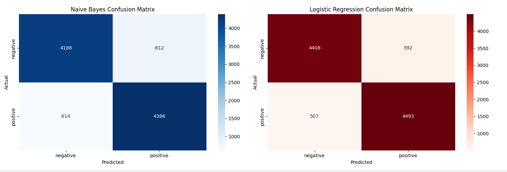

<!-- A clear, descriptive title. This is the first thing people see. -->
# 🎬 Movie Review Sentiment Analysis

<!-- A quick, one-sentence summary. Answers "What is this?" immediately. -->
A machine learning model that classifies movie reviews as positive or negative, achieving 89% accuracy.

<!-- A slightly longer description. Provides context and the project's goal. -->
## 📖 Overview
This project tackles the classic NLP problem of sentiment analysis. It takes raw text from movie reviews, processes it, and uses a Logistic Regression and Naives Bayes model to predict the sentiment (positive/negative). This is a fundamental project for understanding text preprocessing, feature extraction, and model evaluation in NLP.

---

## ✨ Features
<!-- Bullet points are easy to scan. What can this project do? -->
- **Text Preprocessing:** Cleans raw review text (removes HTML, punctuation, stopwords, etc.).
- **Feature Extraction:** Converts text into numerical features using TF-IDF.
- **Machine Learning:** Implements and trains a Logistic Regression classifier and a Naives Bayes model.
- **Model Evaluation:** Includes a detailed analysis with a confusion matrix and classification report.
- **Visualization:** Generates plots to show the most important words for positive and negative reviews.

---

## 🛠️ Tech Stack
<!-- Shows you can work with industry-standard tools. -->
- **Language:** Python 3
- **Libraries:** Pandas, NumPy, Scikit-learn, NLTK, Matplotlib, Seaborn
- **Environment:** Visual Studio Code

---

## 📦 Installation & Usage
<!-- The most critical section. This is a recipe others can follow to get your code running. -->
### Prerequisites
Make sure you have Python and `pip` installed.

### Step-by-Step Guide
1.  **Clone the repository** (get the code onto your machine):
    ```bash
    git clone https://github.com/Yoanax/Movie-Review-Sentiment-Analysis.git
    cd Movie-Review-Sentiment-Analysis
    ```

2.  **Install required libraries** (get the tools the code needs to run):
    ```bash
    pip install pandas numpy scikit-learn nltk matplotlib seaborn jupyter
    ```

3.  **Download NLTK data** (a specific step for this project's NLP part):
    ```bash
    python -c "import nltk; nltk.download('stopwords')"
    ```

4.  **Run the Code on Visual Studio Code**:

---

## 📊 Results
<!-- Proves your project works and shows off your achievements. -->
After training on 40,000 reviews and testing on 10,000 reviews, the Naives Bayes model achieved the following results:

| Metric     | Score |
|------------|-------|
| Accuracy   | 85.74%|
| Precision  | 86%   |
| Recall     | 86%   |
| F1-Score   | 86%   |


The Logistic Regression Model achieved the following results:

| Metric     | Score |
|------------|-------|
| Accuracy   | 89.01%|
| Precision  | 89%   |
| Recall     | 89%   |
| F1-Score   | 89%   |

**Confusion Matrix:**
<!-- You would add an image here later -->
 *This image shows how many reviews were classified correctly and incorrectly.*

**Key Insights:** The words "great", "excellent", and "perfect" were the strongest indicators of positive reviews, while "awful", "worst", and "waste" were the strongest indicators of negative reviews for the Logistic Regression Model.

---

## 🗂️ Project Structure
<!-- Helps people navigate your code without getting lost. -->
Movie-Review-Sentiment-Analysis/
│
├── IMDB Dataset.csv # Raw data
│
├── main.py #The Whole Code
│
└── README.md # This file!

## 👏 Acknowledgments
<!-- It's good practice to credit your data sources. -->
- Dataset provided by KAGGLE: https://www.kaggle.com/datasets/lakshmi25npathi/imdb-dataset-of-50k-movie-reviews
- Inspired by various tutorials and courses on NLP.
